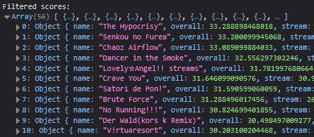

# Etterna MSD fetcher for different score grades

## How to use the script:
1. Make sure you have [Greasemonkey](https://greasespot.net)/[Tampermonkey](https://www.tampermonkey.net/) installed in your browser.
2. Install by clicking [here](https://raw.githubusercontent.com/ger0/etternaonline-msd-grade-fetcher/refs/heads/main/fetcher.user.js) or, [open the script code in your browser](https://github.com/ger0/etternaonline-msd-grade-fetcher/blob/main/fetcher.user.js) if script installation doesn't prompt automatically (click "Raw" button on GitHub, it should automatically prompt to install the script).
3. Once installed, navigate to an Etterna Online profile page while being logged in to your account (e.g., https://etternaonline.com/users/USERNAME) and click the "Fetch Rank MSD" button **(takes quite a lot of time depending on how big the score count is)**. 
4. If you wanna see top scores for a certain grade, check the console (F12) once all scores are being loaded. 

  
Preview

  
  

### TODO:
- Top scores display in the page
- Cross-page support

If script installation doesn't prompt automatically, you can manually copy the code from [this file](https://github.com/ger0/etternaonline-msd-grade-fetcher/blob/main/fetcher.user.js) and create a new userscript in your greasemonkey/tampermonkey extension.
